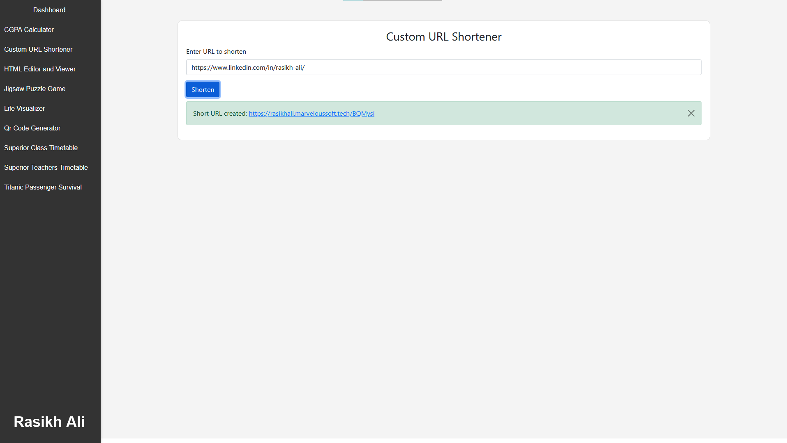

# Custom URL Shortener

The **Custom URL Shortener** is a Flask-based web application that allows users to shorten long URLs into a unique short link. This application generates a random short URL and stores the mapping along with the user's IP address. It also features a simple front-end interface built with Bootstrap and includes the ability to handle redirects.

## Features

- **Custom URL Shortening**: Input a long URL and receive a unique short URL.
- **CSV-based Storage**: URL mappings are saved in a CSV file along with the user's IP address.
- **IP Tracking**: The IP address of the user who generated the shortened URL is saved.
- **Redirection**: When accessing the short URL, the user is automatically redirected to the original URL.
- **AJAX-based Form Submission**: URL shortening is done without reloading the page, making for a smoother user experience.
- **Error Handling**: Displays messages if the URL field is empty or if the short URL doesn't exist.

## Demo

You can try the live version of the application deployed at:  [https://rasikhali.marveloussoft.tech](https://rasikhali.marveloussoft.tech)  
Navigate to the "Custom URL Shortener" tab.

## Dashboard


## How to Run Locally
1. **Clone the repository:**
   ```bash
   git clone https://github.com/your-username/custom-url-shortener.git
   cd custom-url-shortener
   ```

2. **Create a virtual environment and activate it (optional but recommended):**

   ```bash
   python -m venv venv
   source venv/bin/activate  # On Windows use `venv\Scripts\activate`
   ```

3. **Install the required dependencies:**
   ```bash
   pip install -r requirements.txt
   ```

4. **Run the Flask application:**
   ```bash
   python app.py
   ```

5. **Access the application:**
   Open your browser and visit `http://127.0.0.1:5000/`.

## How it Works
- The user inputs a long URL in the form and submits it.
- The server generates a random unique short ID and stores the mapping in a CSV file along with the user's IP address.
- The user receives a short URL that can be used to redirect to the original URL.
- If a user accesses the short URL, they are redirected to the corresponding original URL.

## File Structure
```
.
├── app.py                 # Main Flask application file
├── templates
│   └── index.html         # HTML file for the front-end interface
├── dashboard.png          # Image used in README.md
├── urls.csv               # CSV file storing URL mappings
├── requirements.txt       # Python dependencies
├── readme.md              # Project documentation
```

## Dependencies
- Flask
- Bootstrap
- Python (3.x)

### `requirements.txt`:
```
Flask==2.1.2
```
